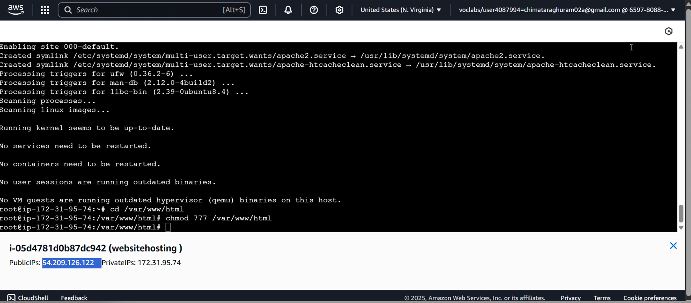
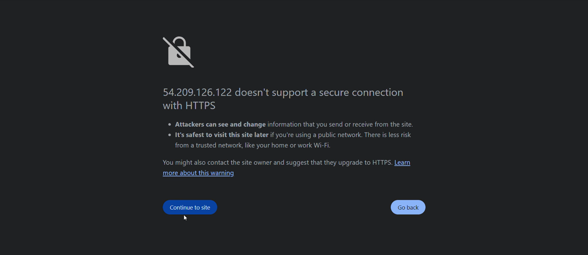
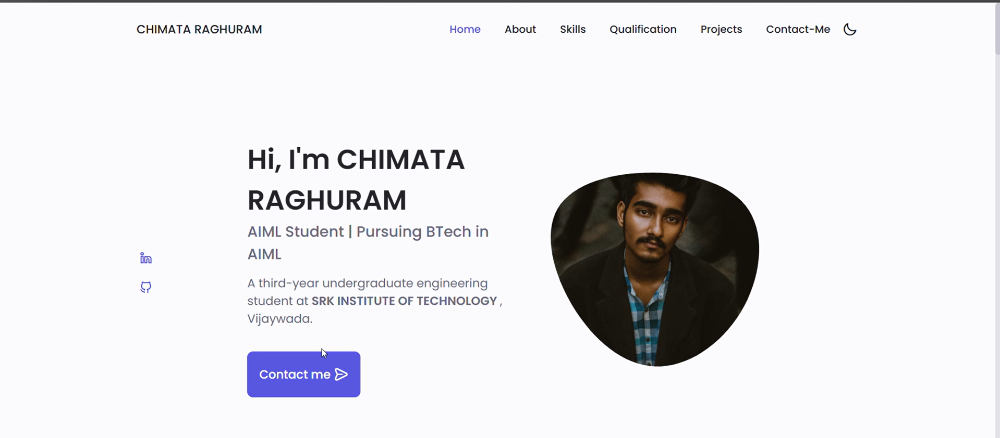
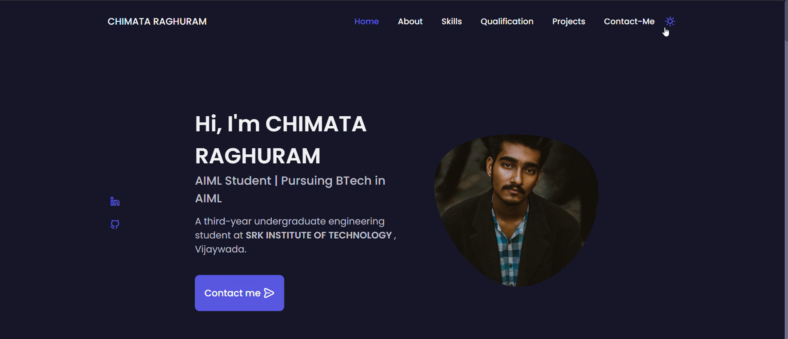
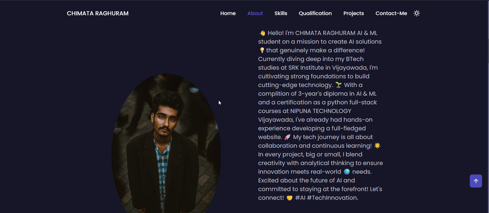
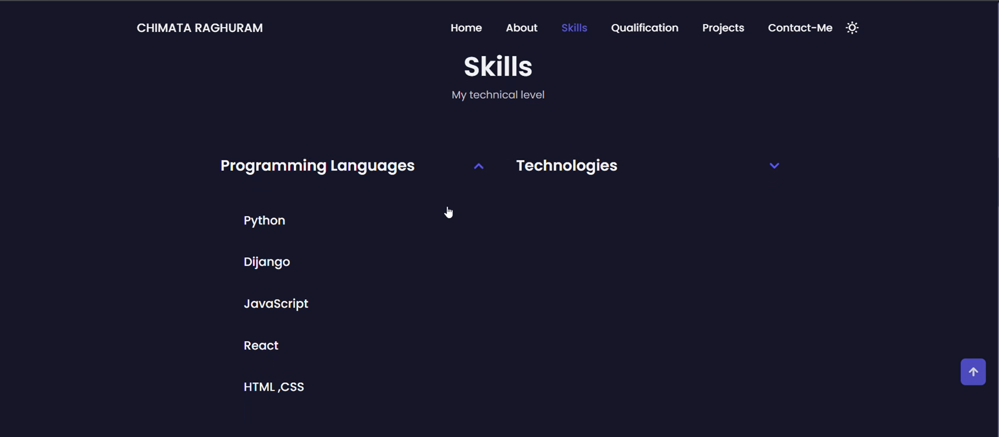
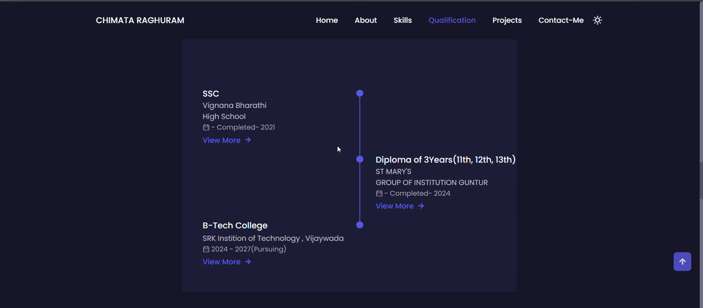
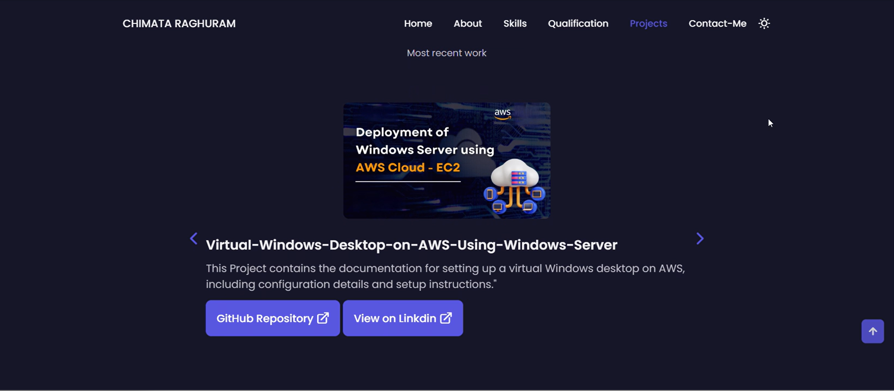

# AWS EC2 Website Deployment Using Ubuntu & Apache2

## 📌 Project Overview

This project demonstrates the deployment of a static website on an AWS EC2 Ubuntu Server using Apache2. The website used for deployment is a personal portfolio developed with HTML, CSS, and JavaScript.

The primary objective of this project was to gain hands-on experience with cloud computing, Linux server administration, and web hosting technologies.

---

## 🛠️ Technologies Used

### Frontend

* HTML5
* CSS3
* JavaScript

### Cloud & Deployment

* AWS EC2
* Ubuntu Server
* Apache2 Web Server
* SSH

---

## ✨ Features

* Responsive website design
* Cloud hosting on AWS EC2
* Apache2 web server configuration
* Linux-based server management
* Secure remote access using SSH
* Real-world deployment workflow

---

## 📂 Project Structure

```bash
project/
│
├── index.html
├── style.css
├── script.js
├── assets/
│   ├── images/
│   └── icons/
│
└── README.md
```

---

## ⚙️ Deployment Process

### 1. Launch AWS EC2 Instance

* Created an Ubuntu EC2 instance.
* Configured Security Groups to allow:

  * SSH (Port 22)
  * HTTP (Port 80)
  * HTTPS (Port 443)

### 2. Connect to Server

```bash
ssh -i key.pem ubuntu@your-public-ip
```

### 3. Update Server

```bash
sudo apt update
sudo apt upgrade -y
```

### 4. Install Apache2

```bash
sudo apt install apache2 -y
```

### 5. Verify Apache Status

```bash
sudo systemctl status apache2
```

### 6. Upload Website Files

```bash
sudo cp -r * /var/www/html/
```

### 7. Restart Apache

```bash
sudo systemctl restart apache2
```

### 8. Access Website

Open:

```bash
http://your-public-ip
```

---

## 📚 What I Learned

* AWS EC2 instance management
* Linux command-line operations
* Apache2 installation and configuration
* SSH connectivity and server administration
* Website deployment workflows
* Cloud hosting fundamentals
* Basic DevOps concepts

---

## 🎯 Career Benefits

This project helped me:

* Strengthen cloud computing fundamentals
* Gain practical Linux server experience
* Understand web hosting infrastructure
* Learn deployment workflows used in industry
* Build a foundation for Full Stack Development and AI application hosting

---

## 🏢 Internship Project

This project was completed as part of my internship with Andhra Pradesh State Skill Development Corporation (APSSDC).

---

## 📸 Project Screenshots

### 1. AWS EC2 Setup & Dashboard

*Screenshot demonstrating the initial cloud setup or project configuration.*

### 2. Server Configuration

*Server environment setup and backend preparation.*

### 3. Apache & Website Deployment

*Configuring Apache2 web server and setting up the project files.*

### 4. Live Website Overview

*A look at the fully deployed live website.*

### 5. Project Interface - Part 1

*Detailed view of the project interface and features.*

### 6. Project Interface - Part 2

*Additional UI components and layout structure.*

### 7. Interactive Elements

*Highlighting interactive features of the web application.*

### 8. Final Output & Details

*Final output of the completed web deployment.*

---

## 👨💻 Author

Raghu

Aspiring AI Engineer | Python Full Stack Developer | Cloud & AI Enthusiast

GitHub: https://github.com/Raghu02a

LinkedIn: https://linkedin.com/in/chimataraghuram
